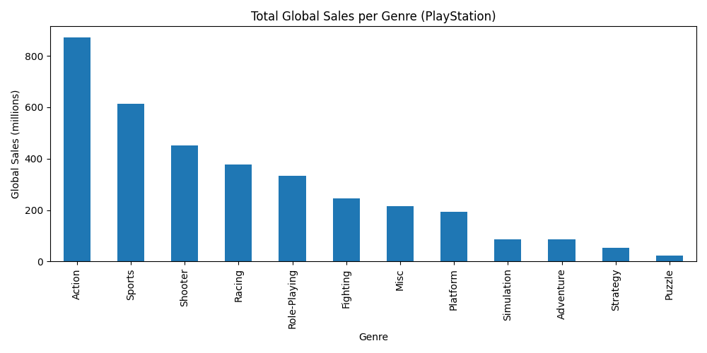
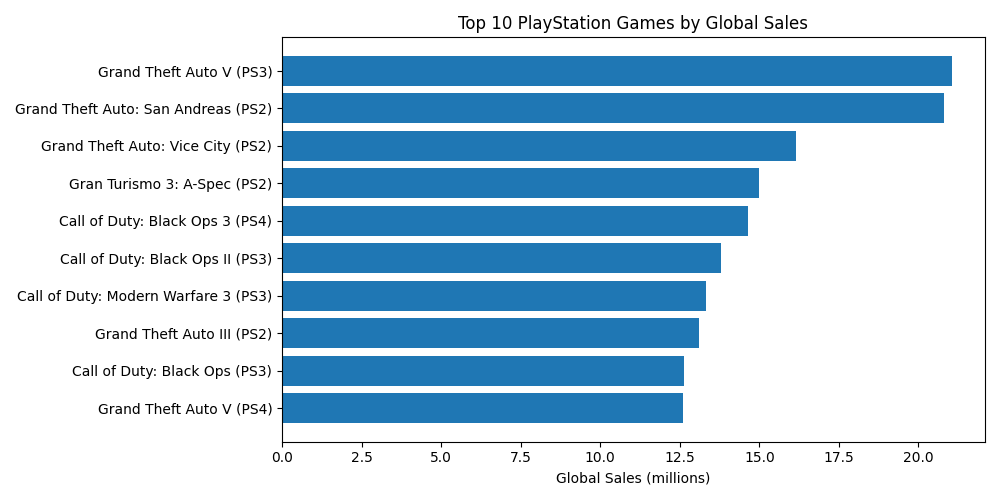

# PlayStation Gaming Data Analysis Project

This repository demonstrates exploratory and descriptive analysis on a dataset of video games that includes sales figures, critic reviews, user scores and metadata.  By filtering the data to PlayStation platforms you can uncover which titles, genres and publishers drive the most success on Sony’s consoles.

## Dataset

We use the **Video\_Games.csv** dataset from the open‐source GitHub project “Video‑Game‑Sales‑Dataset”.  The CSV contains one row per video game, with columns for the game name, platform, year of release, genre, publisher, sales by region (North America, Europe, Japan and Other), global sales, critic score, critic count, user score, user count, developer and ESRB rating【161448525291208†L246-L253】.  The dataset spans multiple platforms and is large enough to support meaningful PlayStation‑specific queries【347032683950304†L55-L63】.

**Note:** The raw dataset is not included in this repository for licensing and size reasons.  To run the analysis you should download `Video_Games.csv` from the upstream repository and place it in the `data/` folder.  Alternatively, modify the code to load the file directly from the raw GitHub URL.

## Data Cleaning

Before analysing the data you need to clean it:

1. **Convert data types.**  Cast the `Year_of_Release` column to integer and handle missing values; convert `User_Score` and all sales columns to numeric, coercing errors to NaNs and then filling or dropping as appropriate.
2. **Handle missing values.**  Remove rows with missing or zero global sales or release year; for other columns decide whether to impute or drop depending on your analysis needs.
3. **Trim and standardise text fields.**  Strip whitespace in the `Name`, `Genre`, `Publisher` and `Developer` columns and remove duplicate rows.
4. **Filter for PlayStation.**  PlayStation games have platform codes beginning with `PS` (e.g. `PS2`, `PS3`, `PS4`).  Use a string starts‑with filter to create a PlayStation subset for analysis.

## Example SQL Queries

You can import the CSV into a SQLite database and run SQL queries.  Here are a few examples:

```sql
-- Top 10 PlayStation games by global sales
SELECT Name, Platform, SUM(Global_Sales) AS Total_Sales
FROM video_games
WHERE Platform LIKE 'PS%'
GROUP BY Name, Platform
ORDER BY Total_Sales DESC
LIMIT 10;

-- Yearly sales trend for PlayStation consoles
SELECT Year_of_Release AS Year,
       SUM(Global_Sales) AS Total_Sales
FROM video_games
WHERE Platform LIKE 'PS%'
GROUP BY Year
ORDER BY Year;

-- Top genres on PlayStation platforms by total global sales
SELECT Genre,
       SUM(Global_Sales) AS Total_Sales
FROM video_games
WHERE Platform LIKE 'PS%'
GROUP BY Genre
ORDER BY Total_Sales DESC;

-- Average critic score versus average global sales for PlayStation games
SELECT AVG(Critic_Score) AS Avg_Critic_Score,
       AVG(Global_Sales) AS Avg_Global_Sales
FROM video_games
WHERE Platform LIKE 'PS%' AND Critic_Score IS NOT NULL;

-- Top publishers of PlayStation games by global sales
SELECT Publisher,
       SUM(Global_Sales) AS Total_Sales
FROM video_games
WHERE Platform LIKE 'PS%'
GROUP BY Publisher
ORDER BY Total_Sales DESC
LIMIT 10;
```

These queries use aggregations, filtering and grouping to surface insights about sales performance, trends and publisher strength on PlayStation platforms.  You can extend them with window functions or subqueries for deeper analysis.

## Python Analysis (src/analysis.py)

The provided `src/analysis.py` script demonstrates how to load the data with pandas, clean it, and perform several analyses.  A brief excerpt:

```python
import pandas as pd
import matplotlib.pyplot as plt

def load_and_clean(filepath: str) -> pd.DataFrame:
    df = pd.read_csv(filepath)
    # Convert columns
    df['Year_of_Release'] = pd.to_numeric(df['Year_of_Release'], errors='coerce')
    df['User_Score'] = pd.to_numeric(df['User_Score'], errors='coerce')
    for col in ['NA_Sales','EU_Sales','JP_Sales','Other_Sales','Global_Sales']:
        df[col] = pd.to_numeric(df[col], errors='coerce')
    # Drop rows with missing year or sales
    df = df.dropna(subset=['Year_of_Release','Global_Sales'])
    # Filter PlayStation platforms
    ps_df = df[df['Platform'].str.startswith('PS', na=False)].copy()
    return ps_df

if __name__ == '__main__':
    data_path = 'data/Video_Games.csv'
    ps_df = load_and_clean(data_path)
    # Top 10 PlayStation games by global sales
    top_ps = (ps_df.groupby(['Name','Platform'])['Global_Sales']
                     .sum()
                     .reset_index()
                     .sort_values('Global_Sales', ascending=False)
                     .head(10))
    print(top_ps)
    # Generate a bar chart of top genres by sales
    genre_sales = ps_df.groupby('Genre')['Global_Sales'].sum().sort_values(ascending=False)
    genre_sales.plot(kind='bar', title='Top PlayStation Genres by Global Sales')
    plt.tight_layout()
    plt.savefig('results/genre_sales.png')
    plt.show()
```

Run the script from the repository root after downloading the dataset; it will output a top‑10 table and generate a chart in the `results/` directory.

## Repository Structure

## Results

### Total Global Sales per Genre (PlayStation)


### Top 10 PlayStation Games by Global Sales


Raw table: [top10_playstation.csv](results/top10_playstation.csv)


